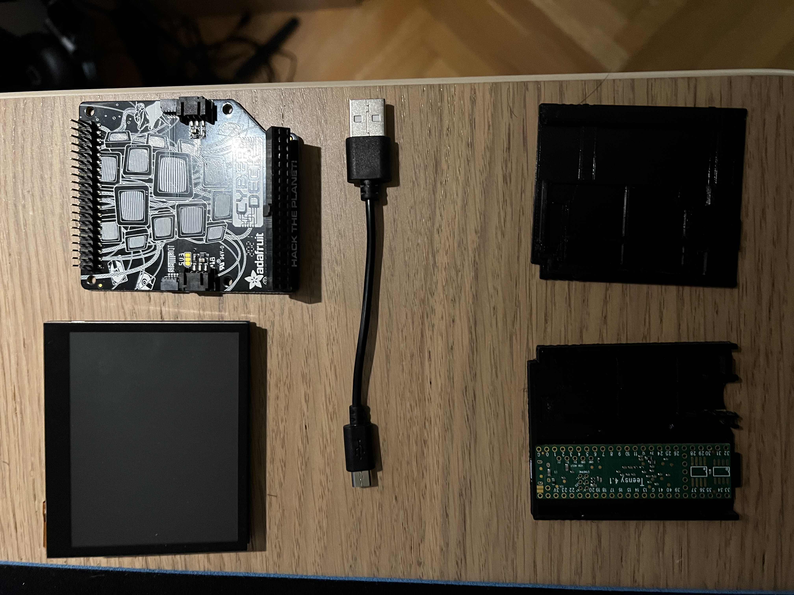

# M8-CyberDeck-400

## _Setup guide_

## PARTS:
- Teensy 4.1 
- Teensy 4.1 case (I found this one to fit):
https://www.printables.com/en/model/192979-teensy-41-gameboy-cartridge-case 
- USB A to Micro USB cable
- Adafuit CyberDeck for Pi 400: https://www.adafruit.com/product/4863
- WaveShare 3.5inch touch screen display: https://www.waveshare.com/product/displays/lcd-oled/lcd-oled-2/3.5inch-dpi-lcd.htm
- Raspberry Pi 400
- MicroSD card x2 (I used 2x SunDisc 64Gb)

## Software:
- Teensy M8 headless (installed directly on Teensy SD card):
https://github.com/Dirtywave/M8HeadlessFirmware

- M8WebDisplay (runs in chromium browsers):
https://github.com/derkyjadex/M8WebDisplay

    or when you connected everything to Pi just visit: https://derkyjadex.github.io/M8WebDisplay/

- Raspberry Pi OS (64bit) installed on Pi 400:
https://www.raspberrypi.com/software/

## Note:
In my setup I use bluetooth for audio out from Pi directly to my speakers so I didn't need USB audio interface, there are many cheap ones that will do the job if you need it.

## How to put Teensy in CyberDeck:

There is empty space between the deck and the display, just tuck the Teensy in middle behind the screen and plug it in.
